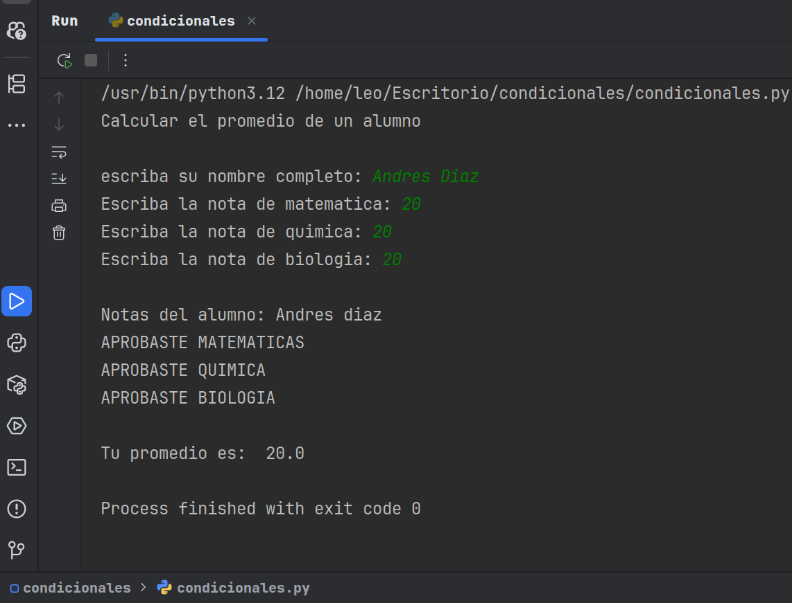

# Python Conditional Statements: If, Else, Elif
Este repositorio presenta un ejemplo práctico y didáctico del uso de las estructuras condicionales if, else y elif en Python. Se ilustra su aplicación en un escenario común: el cálculo y la evaluación de promedios académicos.

## Características Destacadas:
Lógica de Evaluación: Implementación de condicionales para determinar el estado de aprobación/reprobación basado en notas de estudio.

## Cálculo de Promedio: Un método sencillo para calcular el promedio de varias notas.

## Visualización Clara: El sistema muestra de forma organizada las notas individuales, las materias aprobadas y el promedio final de cada estudiante.

## Código Legible: Un ejemplo ideal para entender el flujo de control y la toma de decisiones en Python.

## Este proyecto demuestra mi capacidad para:

Implementar lógica de negocio: Traducir requisitos funcionales (cálculo de notas, aprobación) en código operativo.

## Estructurar código: Organizar sentencias condicionales de manera eficiente y legible.

Desarrollo de funcionalidades básicas: Crear herramientas prácticas con fundamentos de programación esenciales
- 
- **Autor: @AndresGolDev** - [Github link:](https://github.com/tu-usuario
